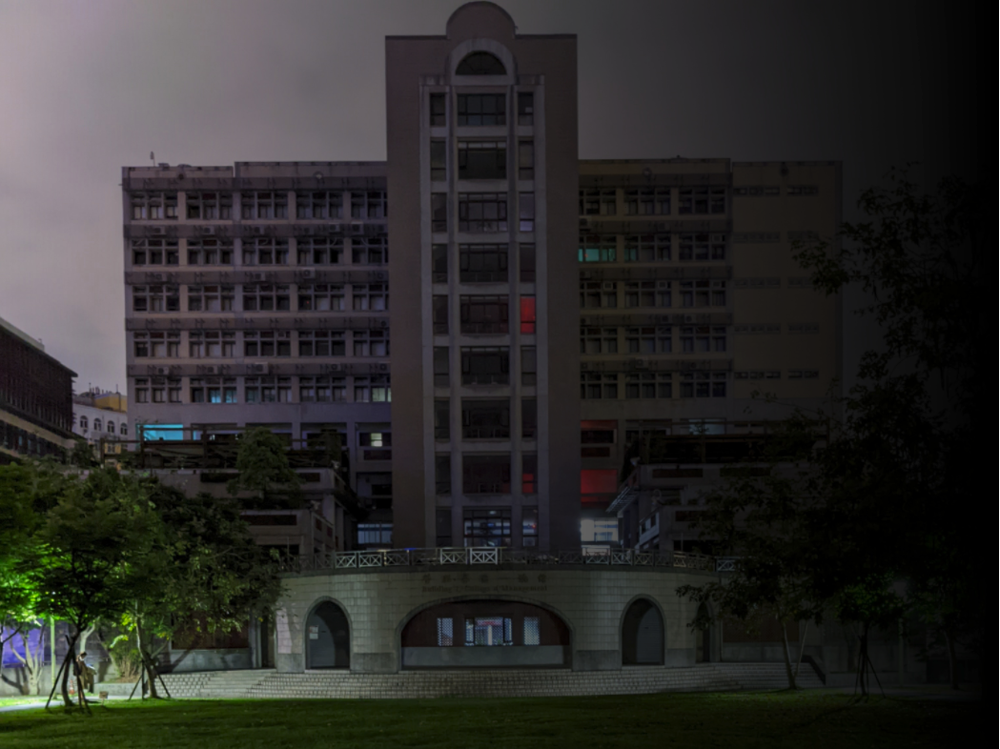
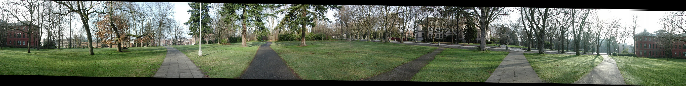
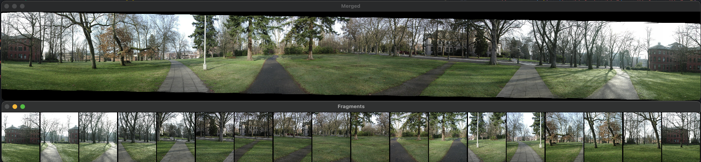

# Image Stitching


- [X] feature detection
- [X] feature matching
- [X] image matching
- [X] blending

### Environment

* Install dependencies
  ```shell
  pip3 install -r requirements.txt
  ```

### Usage
```shell
python3 main.py --data [input dir] --output [result.png] --fc [focal length]
```

### Code Works

* **Cylindrical Projection**
  將影像投影到圓柱座標，使得後續的位移計算可以二維的移動完成

* **Response Detection**
  計算影像上每個pixel的gradient `g`，將`g`以Gaussian filter建立covariance matrix，計算covariance matrix `M`的`determinant(M) / trace(M)`，以`Maximum filter` 取 `3x3` 的 local maximum 後篩選 `> 10` 的值作為 `Response map`

* **Oriented Patch**
  對 `Response map` 以 `Gaussian filter sigma=4.5` 處理後
  1. 以每個 response 為中心取樣一個 `40x40` 的 patch 後 rescale 成 `1/5`，即得一個 `8x8` 的 patch
  2. 取 `gradient g` normalize `gradient g` 取得角度後用以旋轉 patch，得到一個 `oriented patch`

* **Wavelet Hashmap**
  對每個 `oriented patch` 分別以 3 種不同的 `pattern matrix` 相乘後累加，得到一個以 3 個 float 構成的 `tuple`，以此作為 key，`oriented patch` 作為 value，建立hashmap。
  key 的值以固定的區間切分成10個 bins，總共會有1000個 bins

* **Feature Matching**
  以一張圖片的所有 `oriented patch` 計算此 `oriented patch` 在另一張圖片的 `wavelet hashmap` 中對應的 bin ，若該 bin 中有多個 `oriented patch` 則計算 patch 的 `mse`，選擇 `mse`最低且 `mse < 1e-4` 的 `oriented patch` 做為匹配到的結果

  

* **RANSAC**
  在得到匹配的位置後，以 `RANSAC` 選取 inliers 最多的 sample，若 移動向量的 x 和 y 都 `< 5` 則計入 inliers，取 inliers 移動向量的平均作為最終的移動向量

* **Blending**
  對2張影像的交界處的 intensity 以 `1 / intersection_length` 為斜率降低，然後將影像疊合得到結合後的成果
  


### Results

* **Parrington**
  
  <!--  -->
